# Drakvalvet – hela berättelsen

> Genererad från `packages/content/src/watchtower.ts` med `npm run story`. Redigera inte för hand; kör skriptet igen efter ändringar i berättelsen.

**44 scener** · starter: Väktarnas arv → `roadIntro`, Skogsbys hemligheter → `skogsbyReturn` · slut: `ending`

✅ Alla scener går att nå från någon start.

## Så läser du dokumentet

- **Översikt**: varje scen på en rad, numrerad, med vart valen leder. Börja här för att se hela handlingen.
- **Scener**: samma nummer, med hela texten och alla detaljer.
- ⚔ = strid. [kräver …] = valet syns bara om villkoret är uppfyllt. [Athletics DC 10] = färdighetsslag; "misslyckat →" visar vart ett misslyckande leder.
- `id` i kodstil är scenens namn i koden (`packages/content/src/watchtower.ts`).
- **Bilaga** sist: samma karta som flödesschema (Mermaid).

## Översikt

### Prolog: Tre Lyktor och vakttornet

- **1. Vägen mot Gråskogen** `roadIntro`
  - "Gå in på värdshuset" → 2. Värdshuset Tre Lyktor
- **2. Värdshuset Tre Lyktor** `inn`
  - "Dra vapnet och gå mot dörren" → 5. Blod på tröskeln
  - "Gå till fönstret och spana först" → 3. Genom regnet
  - "Fråga mannen vad han inte berättar" → 4. Det gamla sigillet
- **3. Genom regnet** `window`
  - "Varna alla och ta position vid dörren" → 5. Blod på tröskeln
  - "Smyg ut genom köket och försök flankera dem" → 6. Bakom vedboden
- **4. Det gamla sigillet** `oldman`
  - "Ta sigillet och möt hotet utanför" → 5. Blod på tröskeln
- **5. Blod på tröskeln** ⚔ `door`
  - seger → 7. En väg in i skogen
- **6. Bakom vedboden** ⚔ `ambush`
  - seger → 7. En väg in i skogen
- **7. En väg in i skogen** `afterBandits`
  - "Ge dig av mot vakttornet direkt" → 9. Gråskogen
  - "Vila kort och bind om såren — återfå 8 HP" → 8. En kort vila
- **8. En kort vila** `rest`
  - "Följ vägen mot tornet" → 9. Gråskogen
- **9. Gråskogen** `forest`
  - "Undersök den övergivna lägerplatsen" → 10. Jägarnas läger
  - "Följ spåren bort från stigen" → 11. Spår i mossan
  - "Gå direkt mot tornet" → 12. Det fallna vakttornet
- **10. Jägarnas läger** `camp`
  - "Fortsätt mot tornet" → 12. Det fallna vakttornet
- **11. Spår i mossan** `tracks`
  - "Ta den dolda stigen till tornet" → 12. Det fallna vakttornet
- **12. Det fallna vakttornet** `towerExterior`
  - "Gå mot huvudingången" → 13. Vakten vid tornet
  - "Visa sigillet öppet och försök bluffa dig förbi" [kräver sigillet · Deception DC 12] → 15. Drakens tecken · misslyckat → 17. Fel svar
  - "Använd repet och ta dig in genom sprickan" [kräver repet · Athletics DC 10] → 14. Genom muren · misslyckat → 16. Stenen som gav vika
- **13. Vakten vid tornet** ⚔ `towerFight`
  - seger → 18. Under tornet
- **14. Genom muren** `towerSneak`
  - "Gå ner i tornets inre" → 18. Under tornet
- **15. Drakens tecken** `towerBluff`
  - "Gå in i tornet" → 18. Under tornet
- **16. Stenen som gav vika** ⚔ `towerSneakFail`
  - seger → 18. Under tornet
- **17. Fel svar** ⚔ `towerBluffFail`
  - seger → 18. Under tornet
- **18. Under tornet** `towerHall`
  - "Tänd ljus och gå försiktigt framåt" → 19. Den blinda väktaren
  - "Ropa ut i mörkret" → 20. Ett misstag i mörkret
- **19. Den blinda väktaren** ⚔ `cryptBeast`
  - seger → 21. Stendörren
- **20. Ett misstag i mörkret** ⚔ `cryptBeastLoud`
  - seger → 21. Stendörren
- **21. Stendörren** `sealedDoor`
  - "Lämna platsen tills vidare" → 24. Inte ännu
  - "Använd sigillet och öppna dörren" [kräver sigillet] → 22. Drakvalvet
  - "Försök använda järnmyntet från rövarna" [kräver järnmyntet] → 23. Den brutna förseglingen
- **22. Drakvalvet** `vault`
  - "Återvänd mot Skogsby" → 25. Kapitel 1 – Skogsby
- **23. Den brutna förseglingen** `vaultRough`
  - "Återvänd mot Skogsby" → 25. Kapitel 1 – Skogsby
- **24. Inte ännu** `endingLeave`
  - "Återvänd mot Skogsby" → 25. Kapitel 1 – Skogsby

### Kapitel 1: Skogsby

- **25. Kapitel 1 – Skogsby** `skogsbyReturn`
  - "Möt jägaren vid vägskälet" → 26. Mira Hök
- **26. Mira Hök** `miraMeet`
  - "Berätta allt – även om ruinen och det ni fann under tornet" → 27. Ett förtroende
  - "Berätta om jägarna men håll valvet och sigillet för er själva" → 28. Halva sanningen
  - "Fråga först vad Mira själv vet om jägarna och tornet" → 29. Spår som inte hör hemma där
- **27. Ett förtroende** `miraTruth`
  - "Gå vidare in i Skogsby" → 30. Smedjan vid torget
- **28. Halva sanningen** `miraGuarded`
  - "Gå vidare in i Skogsby" → 30. Smedjan vid torget
- **29. Spår som inte hör hemma där** `miraHunters`
  - "Gå vidare in i Skogsby" → 30. Smedjan vid torget
- **30. Smedjan vid torget** `smithMeet`
  - "Låt Runa undersöka myntet och sigillet ordentligt" → 31. Metall som inte borde spricka
  - "Fråga om de försvunna järnleveranserna" → 32. Vagnar som aldrig kom fram
  - "Erbjud er att hjälpa om nästa leverans också uteblir" → 33. Ett löfte vid ässjan
- **31. Metall som inte borde spricka** `smithInspect`
  - "Sök upp den gamle mannen från Tre Lyktor" → 34. Edric från Tre Lyktor
- **32. Vagnar som aldrig kom fram** `smithDeliveries`
  - "Sök upp den gamle mannen från Tre Lyktor" → 34. Edric från Tre Lyktor
- **33. Ett löfte vid ässjan** `smithFavor`
  - "Sök upp den gamle mannen från Tre Lyktor" → 34. Edric från Tre Lyktor
- **34. Edric från Tre Lyktor** `edricMeet`
  - "Säg lugnt att ni behöver sanningen, inte fler gåtor" → 35. Väktarnas namn
  - "Pressa honom: Du visste vad som fanns under tornet" → 36. Ord under press
  - "Beskriv ögonen och den mörka kristallen i valvet" [kräver valvet öppnat eller valvet lämnat förseglat] → 37. Det som väcktes under stenen
- **35. Väktarnas namn** `edricOpen`
  - "Låt kvällen falla över Skogsby" → 38. En kväll i Skogsby
- **36. Ord under press** `edricConfront`
  - "Låt kvällen falla över Skogsby" → 38. En kväll i Skogsby
- **37. Det som väcktes under stenen** `edricVault`
  - "Låt kvällen falla över Skogsby" → 38. En kväll i Skogsby
- **38. En kväll i Skogsby** `villageEvening`
  - "Sitt kvar på värdshuset och lyssna på byns rykten" → 39. Rykten vid elden
  - "Gå tidigt till sängs och vila inför morgondagen" → 40. Vagnen som saknar sin last
- **39. Rykten vid elden** `villageRumors`
  - "Gå till vila" → 40. Vagnen som saknar sin last
- **40. Vagnen som saknar sin last** `wagonArrival`
  - "Undersök vagnen och den plats där kistan stod" → 41. Under kuskbocken
  - "Hämta Mira innan spåren kallnar" [kräver Miras spår] → 42. Spår österut
  - "Hämta Edric och visa honom drakmärket" [kräver Edric litar (2) eller Edric litar helt (3)] → 43. Ett märke som borde vara dött
- **41. Under kuskbocken** `wagonSearch`
  - "Fortsättning följer i nästa del av Kapitel 1" → 44. Kapitel 1 har börjat
- **42. Spår österut** `wagonMira`
  - "Fortsättning följer i nästa del av Kapitel 1" → 44. Kapitel 1 har börjat
- **43. Ett märke som borde vara dött** `wagonEdric`
  - "Fortsättning följer i nästa del av Kapitel 1" → 44. Kapitel 1 har börjat
- **44. Kapitel 1 har börjat** · SLUT `ending`

## Scener

### 1. Vägen mot Gråskogen

`roadIntro`

> Tre dagar har gått sedan du lämnade den trafikerade delen av Kungsvägen och vek av norrut mot Gråskogen.
>
> Sedan dess har gårdarna blivit färre, vägen smalare och träden tätare. Den sista milstolpen du passerade var så vittrad att namnet inte längre gick att läsa.
>
> Kartan i din ficka visar vägen mot **Skogsby**, den sista större bosättningen innan Gråskogen tar vid på allvar. Du har ingen särskild anledning att dröja i trakten. Skogsby är bara nästa plats längs vägen.
>
> På det förra värdshuset sa man att vägen dit inte brukade vara farlig.
>
> Bara öde.
>
> Regnet har följt dig sedan eftermiddagen och blivit kallare för varje timme. När mörkret börjar lägga sig mellan granarna ser du till sist ett varmt ljus längre fram.
>
> Ett lågt värdshus ligger vid vägkanten. Ovanför dörren gungar en sliten träskylt i vinden. På den syns tre målade lyktor, blekta av många års regn och vinter.
>
> **Tre Lyktor.**
>
> Du skyndar de sista stegen mot huset, mer för värmen än för något annat.
>
> Än så länge.

**Val:**

- Gå in på värdshuset · → `inn`

### 2. Värdshuset Tre Lyktor

`inn`

> Värmen slår emot dig när dörren öppnas. Det luktar vedrök, våt ull och mat från grytan över elden.
>
> Vid ett av borden sitter en äldre man i grå ullkappa. Framför honom ligger en karta med ett ensamt kryss där skogen blir som tätast.
>
> “På väg mot Skogsby?” frågar han. Sedan pekar han på krysset. “Vakttornet. Tre jägare gick dit för fyra dagar sedan. Ingen kom tillbaka. I natt såg vi ljus mellan träden.”
>
> Innan du hinner svara hörs snabba, ojämna hovslag ute i mörkret.
>
> Ett kort rop — sedan ett tungt slag mot ytterdörren.

**Val:**

- Dra vapnet och gå mot dörren · → `door`
- Gå till fönstret och spana först · → `window`
- Fråga mannen vad han inte berättar · → `oldman`

### 3. Genom regnet

`window`

> Du drar undan gardinen en handsbredd. På gårdsplanen står en sadellös häst, täckt av skum. Någon ligger hopkrupen bredvid brunnen.
>
> Längre bort, precis där lyktskenet dör, rör sig två mörka gestalter mot värdshuset. Den ene har båge.
>
> Du har några sekunders försprång.

**Ändrar:** `hjälten.warned: false → true`

**Val:**

- Varna alla och ta position vid dörren · → `door`
- Smyg ut genom köket och försök flankera dem · → `ambush`

### 4. Det gamla sigillet

`oldman`

> Mannen ser mot dörren, sedan på dig. Till sist drar han fram något ur rocken: en liten bronsskiva märkt med en drake vars vingar bildar en cirkel.
>
> “Min far hittade den i tornet när jag var barn. Han sade att tornet inte byggdes för att vaka över vägen. Det byggdes för att vaka över något under marken.”
>
> Han skjuter sigillet över bordet. “Om du går dit — ta detta.”

**Ändrar:** `hjälten.sigil: false → true`

**Berättelse-XP:** 20 – Ni avslöjade det gamla sigillets betydelse.

**Val:**

- Ta sigillet och möt hotet utanför · → `door`

### 5. Blod på tröskeln

`door`

> Dörren slås upp. En ung ryttare faller in över tröskeln med ena handen pressad mot sidan.
>
> Bakom honom kommer två vägrövare ur regnet. Den främste höjer ett kortsvärd. Bågskytten stannar ute på gården och spänner sin sträng.
>
> Det finns ingen tid kvar för ord.

**Strid** (50 XP, riktiga avstånd) → vid seger: `afterBandits`

- Bandit: 11 HP, AC 12, +3, Scimitar 1d6+1
- Bandit: 11 HP, AC 12, +3, Light Crossbow 1d8+1

### 6. Bakom vedboden

`ambush`

> Du glider ut genom köksdörren. Regnet döljer dina steg. När rånarna når gårdsplanen är du redan bakom dem.
>
> Bågskytten hinner aldrig få upp vapnet innan du rusar fram.

**Ändrar:** `hjälten.warned: false → true`

**Strid** (50 XP, fienden överraskas, riktiga avstånd) → vid seger: `afterBandits`

- Bandit: 11 HP, AC 12, +3, Scimitar 1d6+1
- Bandit: 11 HP, AC 12, +3, Light Crossbow 1d8+1

### 7. En väg in i skogen

`afterBandits`

> När den sista rövaren faller blir gården tyst igen, bortsett från regnet.
>
> På en av kropparna hittar du ett grovt järnmynt märkt med samma draksymbol som på den gamle mannens sigill. Ryttaren på golvet lyckas få fram några ord:
>
> “De har tagit de andra… till tornet.”
>
> Bland rövarnas saker ligger en liten sköld, en flaska läkande brygd och en handfull mynt.

**Ändrar:** `hjälten.gold: 10 → 21`, `hjälten.potions: 2 → 3`, `hjälten.towerKey: false → true`, `hjälten.ac: 16 → 18`, `hjälten.shield: false → true`

**Val:**

- Ge dig av mot vakttornet direkt · → `forest`
- Vila kort och bind om såren — återfå 8 HP · → `rest`

### 8. En kort vila

`rest`

> Du sitter nära elden medan värdshusvärden tvättar blodet från golvet. Efter en halvtimme har skakningen i händerna lagt sig.
>
> Den korta vilan är avslutad. Du har 14/14 HP.
>
> När du går ut har regnet nästan upphört. Molnen ligger lågt över Gråskogen.

**Ändrar:** `hjälten.rested: false → true`

**Val:**

- Följ vägen mot tornet · → `forest`

### 9. Gråskogen

`forest`

> Stigen slingrar sig mellan höga granar och svarta klippor. Ju längre in du går desto tystare blir skogen.
>
> Efter en knapp timme hittar du resterna av en lägerplats. En trasig ryggsäck ligger intill eldstaden. Bredvid den finns färska spår som leder bort från stigen.
>
> Långt fram genom träden skymtar du toppen av ett sönderfallet stentorn.

**Val:**

- Undersök den övergivna lägerplatsen · → `camp`
- Följ spåren bort från stigen · → `tracks`
- Gå direkt mot tornet · → `towerExterior`

### 10. Jägarnas läger

`camp`

> Ryggsäcken tillhör en av de saknade jägarna. Du hittar ett rep, torra fnösken och några medicinska örter.
>
> Under en filt ligger också ett sönderbrutet armborst. Något stort har trampat rakt genom lägret.

**Ändrar:** `hjälten.herbs: 0 → 1`, `hjälten.torch: false → true`, `hjälten.rope: false → true`

**Val:**

- Fortsätt mot tornet · → `towerExterior`

### 11. Spår i mossan

`tracks`

> Spåren leder till en smal ravin. Där hittar du en av jägarna, levande men svårt skadad.
>
> Han berättar att rövarna arbetar åt någon de kallar Väktaren. Under tornet finns en äldre ruin, och rövarna har försökt öppna en stendörr där nere.
>
> “De väckte något”, viskar han. “Det följer ljud.”
>
> Innan du går visar han en dold stig som leder till tornets baksida.

**Ändrar:** `hjälten.bossWeakened: false → true`

**Berättelse-XP:** 25 – Ni fann den saknade jägaren och lärde er mer om Väktaren.

**Val:**

- Ta den dolda stigen till tornet · → `towerExterior`

### 12. Det fallna vakttornet

`towerExterior`

> Tornet står på en bergsrygg som ett avbrutet finger mot himlen. Murarna är täckta av mossa och den övre våningen har rasat in.
>
> Två vakter håller till vid huvudingången. På baksidan syns en spricka i muren, högt över marken.
>
> Någonstans under dina fötter hörs ett dovt, regelbundet slag.

**Val:**

- Gå mot huvudingången · → `towerFight`
- Visa sigillet öppet och försök bluffa dig förbi · → `towerBluff` · Deception (CHA) DC 12, misslyckat → `towerBluffFail` · kräver sigillet
- Använd repet och ta dig in genom sprickan · → `towerSneak` · Athletics (STR) DC 10, misslyckat → `towerSneakFail` · kräver repet

### 13. Vakten vid tornet

`towerFight`

> Vakterna ser dig och drar sina vapen. Den ene bär ringbrynja; den andre håller ett tungt spjut.

**Strid** (35 XP) → vid seger: `towerHall`

- Tornvakt: 10 HP, AC 12, +2, Kortsvärd 1d4
- Spjutvakt: 8 HP, AC 10, +3, Spjut 1d4+1

### 14. Genom muren

`towerSneak`

> Repet håller. Du tar dig upp längs den våta stenen och pressar dig genom sprickan.
>
> Du landar på ett mörkt loft ovanför vakterna och undviker striden helt. Där hittar du en kista som rövarna ännu inte brutit upp.
>
> I den ligger ett välbalanserat gammalt svärd.

**Ändrar:** `hjälten.damage: [2,6,3] → [1,8,3]`, `hjälten.weapon: "Greatsword (2d6)" → "Vaktsvärd (+3 skada)"`

**Berättelse-XP:** 35 – Ni tog er förbi tornvakterna utan strid.

**Val:**

- Gå ner i tornets inre · → `towerHall`

### 15. Drakens tecken

`towerBluff`

> När vakterna ser sigillet förändras deras ansikten. Den ene gör genast en gest mot bröstet.
>
> “Vi trodde att budbäraren redan var nere.”
>
> Du säger ingenting. Efter några spänt tysta sekunder kliver de åt sidan.
>
> Bluffen håller — åtminstone tills någon ställer en fråga.

**Berättelse-XP:** 35 – Ni lurade tornvakterna och undvek striden.

**Val:**

- Gå in i tornet · → `towerHall`

### 16. Stenen som gav vika

`towerSneakFail`

> Halvvägs upp lossnar en sten under din fot. Repet bränner i handflatorna när du glider ner längs muren och slår i marken.
>
> Du har 14/14 HP.
>
> Ljudet ekar mot tornets väggar. Innan du hunnit resa dig står båda vakterna över dig med dragna vapen.

**Ändrar:** `hjälten.hp: 14 → 13`

**Strid** (35 XP, hjältarna överraskas) → vid seger: `towerHall`

- Tornvakt: 10 HP, AC 12, +2, Kortsvärd 1d4
- Spjutvakt: 8 HP, AC 10, +3, Spjut 1d4+1

### 17. Fel svar

`towerBluffFail`

> Vakterna ser sigillet och tvekar. Sedan lutar sig den ene fram.
>
> “Vad är lösenordet för i kväll?”
>
> Du svarar för snabbt. Hans blick hårdnar, och spjutet sänks mot ditt bröst.

**Strid** (35 XP) → vid seger: `towerHall`

- Tornvakt: 10 HP, AC 12, +2, Kortsvärd 1d4
- Spjutvakt: 8 HP, AC 10, +3, Spjut 1d4+1

### 18. Under tornet

`towerHall`

> En spiraltrappa leder ner under marknivå. Luften blir kallare för varje steg.
>
> Längst ner står en järndörr på glänt. Bakom den ligger en korridor byggd av mycket äldre sten än tornet ovanför.
>
> På golvet syns blodspår. Från mörkret hörs ett skrapande ljud.

**Val:**

- Tänd ljus och gå försiktigt framåt · → `cryptBeast`
- Ropa ut i mörkret · → `cryptBeastLoud`

### 19. Den blinda väktaren

`cryptBeast`

> Du går långsamt och håller andan. Då rör sig något mellan pelarna.
>
> Varelsen är blek, nästan utan ögon, med långa armar som släpar mot stenen. Den vrider huvudet mot minsta ljud.
>
> Den hör din stövel skrapa mot stenen och rusar mot dig.

*Om jägarens varning:*

> Jägarens varning räddar dig: du sparkar undan en lös sten åt motsatt håll. Varelsen kastar sig efter ljudet och blottar sidan.

**Strid** (70 XP) → vid seger: `sealedDoor`

- Blind kryptväktare: 16 HP, AC 11, +3, Klor 1d4+1, sårbar: Eld, tålig: Stick

*Om jägarens varning:* Blind kryptväktare 12 HP

### 20. Ett misstag i mörkret

`cryptBeastLoud`

> Ditt rop ekar genom korridoren.
>
> Svaret är ett våldsamt skrapande från mörkret. Något stort kommer springande mot dig.

**Strid** (70 XP) → vid seger: `sealedDoor`

- Blind kryptväktare: 18 HP, AC 11, +3, Klor 1d4+1, sårbar: Eld, tålig: Stick

### 21. Stendörren

`sealedDoor`

> Bakom varelsens näste står stendörren som jägaren beskrev. Draksymbolen finns inhuggen mitt på dörren.
>
> Mitt i symbolen finns en rund fördjupning. Någon har försökt bryta upp den med järnverktyg.
>
> Bakom dörren glimmar ett blåvitt sken.

*Om sigillet:*

> När du håller bronssigillet mot stenen hörs ett djupt klick. Dörren öppnas några centimeter av sig själv.

**Val:**

- Lämna platsen tills vidare · → `endingLeave`
- Använd sigillet och öppna dörren · → `vault` · kräver sigillet
- Försök använda järnmyntet från rövarna · → `vaultRough` · kräver järnmyntet

### 22. Drakvalvet

`vault`

> Stendörren glider upp.
>
> Bakom den finns inte en gravkammare utan en enorm sal som fortsätter bortom ljusets räckvidd. Pelarna är formade som hopvikta drakvingar.
>
> På en piedestal svävar en mörk kristall några centimeter ovanför stenen.
>
> Och långt inne i valvet öppnas två glödande ögon.
>
> Det du har hittat är större än ett försvunnet jaktlag. Detta var bara början.

**Ändrar:** `världen.openedVault: false → true`

**Berättelse-XP:** 50 – Ni upptäckte Drakvalvet.

**Val:**

- Återvänd mot Skogsby · → `skogsbyReturn`

### 23. Den brutna förseglingen

`vaultRough`

> Järnmyntet passar inte riktigt, men när du pressar det mot fördjupningen svarar mekanismen.
>
> Stenen spricker. Dörren rycker upp med ett öronbedövande brak.
>
> Bakom den ligger en enorm underjordisk sal. På en piedestal svävar en mörk kristall.
>
> Något rör sig långt där inne.
>
> Du har öppnat valvet — men inte på det sätt dess byggare avsåg.

**Ändrar:** `världen.openedVault: false → true`, `världen.brokeSeal: false → true`

**Berättelse-XP:** 50 – Ni upptäckte Drakvalvet.

**Val:**

- Återvänd mot Skogsby · → `skogsbyReturn`

### 24. Inte ännu

`endingLeave`

> Du bestämmer dig för att inte öppna dörren utan bättre förberedelser.
>
> På vägen tillbaka genom skogen vet du ändå att du kommer återvända.
>
> Vad som än finns under tornet har väntat länge. Och nu vet det att någon har hittat vägen dit.

**Ändrar:** `världen.leftSealed: false → true`

**Val:**

- Återvänd mot Skogsby · → `skogsbyReturn`

---

# Kapitel 1: Skogsby

### 25. Kapitel 1 – Skogsby

`skogsbyReturn`

> När Gråskogens sista granar glesnar ligger morgondimman fortfarande över fälten. Framför er reser sig Skogsbys låga träpalissad och de första taken syns bakom den.
>
> Efter tornets mörker känns ljudet av en smedshammare, en skällande hund och människor på väg till dagens arbete nästan overkligt vanligt.
>
> Bakom er ligger den förseglade dörren fortfarande stängd. Frågan är hur länge den får förbli så.
>
> Vid vägskälet utanför byn väntar en kvinna i grönbrun jaktkappa. Hon har en långbåge över axeln och känner igen utrustningen från de försvunna jägarna innan hon känner igen er.

*Om valvet öppnat:*

> Bakom er ligger valvet och de glödande ögonen i mörkret. Ni vet ännu inte vad ni såg.

*Om förseglingen bruten:*

> Men minnet av den spruckna förseglingen följer er. Något under tornet vaknade när stenen brast.

**Val:**

- Möt jägaren vid vägskälet · → `miraMeet`

### 26. Mira Hök

`miraMeet`

> “Mira Hök”, säger hon och lägger två fingrar mot pannan till hälsning. “De tre som gick till tornet var mina. Jag har väntat på någon som kunde berätta vad som hände.”
>
> Blicken stannar vid blodfläckarna, järnmyntet och det ni bär med er från tornet. Hon ställer inga fler frågor. Hon väntar bara på ert svar.

**Val:**

- Berätta allt – även om ruinen och det ni fann under tornet · → `miraTruth`
- Berätta om jägarna men håll valvet och sigillet för er själva · → `miraGuarded`
- Fråga först vad Mira själv vet om jägarna och tornet · → `miraHunters`

### 27. Ett förtroende

`miraTruth`

> Ni berättar från början till slut. Mira avbryter inte ens när ni nämner draksymbolen och den gamla dörren under tornet.
>
> När ni är klara räcker hon över ett knippe läkande skogsörter. “Då står vi på samma sida tills jag får anledning att tro något annat.”
>
> Hon berättar också att hon sett främmande stövelspår längs den östra skogsstigen de senaste dagarna — män som försökt undvika både byn och Kungsvägen.

**Ändrar:** `hjälten.herbs: 0 → 1`, `världen.miraTrust: 0 → 2`, `världen.miraTrail: false → true`

**Val:**

- Gå vidare in i Skogsby · → `smithMeet`

### 28. Halva sanningen

`miraGuarded`

> Ni berättar om rövarna och jägarna men lämnar ruinen därhän. Mira lyssnar och nickar långsamt.
>
> “Det där var sanningen”, säger hon till sist. “Men inte hela sanningen.” Hon pressar er inte vidare.
>
> När hon går mot jägarnas hus vet ni att hon kommer hjälpa er om byn hotas — men hon har ännu ingen anledning att anförtro er sina egna misstankar.

**Val:**

- Gå vidare in i Skogsby · → `smithMeet`

### 29. Spår som inte hör hemma där

`miraHunters`

> I stället för att börja med er egen berättelse frågar ni vad hon vet. Mira uppskattar frågan mer än hon visar.
>
> Två dagar före försvinnandet såg jägarna en grupp främmande män röra sig längs en gammal skogsstig öster om tornet. De bar inga färger och köpte ingen proviant i byn.
>
> “Nu berättar ni er del”, säger hon. Ni ger henne det viktigaste. Inte allt — men tillräckligt för att hon ska lova att hjälpa er tyda spåren om de dyker upp igen.

**Ändrar:** `världen.miraTrust: 0 → 1`, `världen.miraTrail: false → true`

**Val:**

- Gå vidare in i Skogsby · → `smithMeet`

### 30. Smedjan vid torget

`smithMeet`

> På torget slår smeden Runa Vargeld igen luckan till sitt kollager med foten och muttrar åt en tom vagnsplats bredvid smedjan.
>
> “Två leveranser på tre veckor”, säger hon när hon ser er blick. “Den ena sen. Den andra kom aldrig. Jag kan smida, men jag kan inte trolla fram järn.”
>
> När järnmyntet från rövarna hamnar i hennes hand väger hon det mot tummen och rynkar pannan. “Dåligt järn. Men märket är gjort med omsorg.”

*Om sigillet:*

> När draksigillet skymtar bland era saker stannar hammaren i hennes hand. “Det där är äldre än något jag har i smedjan.”

**Val:**

- Låt Runa undersöka myntet och sigillet ordentligt · → `smithInspect`
- Fråga om de försvunna järnleveranserna · → `smithDeliveries`
- Erbjud er att hjälpa om nästa leverans också uteblir · → `smithFavor`

### 31. Metall som inte borde spricka

`smithInspect`

> Runa skrapar järnmyntets kant mot en fil. Små mörka flagor lossnar på ett sätt som får henne att svära lågt.
>
> “Det här har inte bara rostat. Något har gjort järnet sprött inifrån.” Hon tittar sedan på drakmärket. “Och jag har sett samma märke på en gammal lastförteckning från bergen.”
>
> Hon lovar att leta fram förteckningen tills ni återkommer.

**Ändrar:** `världen.smithTrust: 0 → 2`, `världen.smithMetalClue: false → true`

**Val:**

- Sök upp den gamle mannen från Tre Lyktor · → `edricMeet`

### 32. Vagnar som aldrig kom fram

`smithDeliveries`

> Runa plockar fram en kolsvart tavla med kritstreck. Två järnleveranser saknas. Båda skulle ha kommit norrifrån via samma sträcka av Kungsvägen.
>
> “Banditer tar pengar, mat och hästar”, säger hon. “Men någon har börjat ta råjärn och verktygsstål. Det är ett märkligt byte om man bara är hungrig.”
>
> Hon visar er märket som användes på följesedlarna. Det påminner obehagligt mycket om symbolen från tornet.

**Ändrar:** `världen.smithTrust: 0 → 1`, `världen.smithMetalClue: false → true`

**Val:**

- Sök upp den gamle mannen från Tre Lyktor · → `edricMeet`

### 33. Ett löfte vid ässjan

`smithFavor`

> Runa skrattar först åt erbjudandet, men när hon märker att ni menar allvar blir hon tystare.
>
> “Hitta min nästa vagn om den försvinner och jag står i skuld till er. En riktig skuld — inte en gratis hästsko.”
>
> Hon berättar att nästa leverans väntas från norr inom ett dygn. För första gången får den tomma vagnsplatsen bredvid smedjan en betydelse.

**Ändrar:** `världen.smithTrust: 0 → 2`, `världen.smithFavor: false → true`

**Val:**

- Sök upp den gamle mannen från Tre Lyktor · → `edricMeet`

### 34. Edric från Tre Lyktor

`edricMeet`

> Ni hittar den gamle mannen från värdshuset på en bänk bakom det lilla kapellet. I dagsljus ser han äldre ut än han gjorde framför elden.
>
> “Edric”, säger han innan ni hinner fråga efter hans namn. “Och jag antar att ni inte kom hit för att tacka mig för sigillet.”
>
> När han hör att ni lämnade dörren stängd sjunker hans axlar, nästan omärkligt.
>
> Han vet mer. Den här gången är frågan hur ni tänker få honom att tala.

*Om valvet öppnat:*

> När han förstår att dörren faktiskt öppnades sluter han ögonen ett ögonblick.

*Om förseglingen bruten:*

> När ni berättar att förseglingen brast försvinner färgen ur hans ansikte.

**Val:**

- Säg lugnt att ni behöver sanningen, inte fler gåtor · → `edricOpen`
- Pressa honom: Du visste vad som fanns under tornet · → `edricConfront`
- Beskriv ögonen och den mörka kristallen i valvet · → `edricVault` · kräver valvet öppnat eller valvet lämnat förseglat

### 35. Väktarnas namn

`edricOpen`

> Edric studerar er länge och nickar sedan. “Rättvist.”
>
> Han berättar att draksymbolen tillhörde en gammal orden som kallades Väktarna. De bevakade inte skatter. De bevakade platser som aldrig fick öppnas utan rätt sigill och rätt kunskap.
>
> “Orden finns inte längre som den en gång gjorde”, säger han. “Men människor använder fortfarande dess namn.” Han lovar att visa er mer när han vet vilka som följt efter er från tornet.

**Ändrar:** `världen.edricTrust: 0 → 2`, `världen.keeperLore: false → true`

**Val:**

- Låt kvällen falla över Skogsby · → `villageEvening`

### 36. Ord under press

`edricConfront`

> “Ja”, säger Edric till slut. “Jag visste att det fanns något under tornet. Nej, jag visste inte vad som fortfarande levde där.”
>
> Han ger er ett namn: Väktarna. Mer än så vägrar han säga medan ilskan fortfarande ligger mellan er.
>
> Ni får sanningen ni krävde — men inte hans förtroende.

**Ändrar:** `världen.keeperLore: false → true`

**Val:**

- Låt kvällen falla över Skogsby · → `villageEvening`

### 37. Det som väcktes under stenen

`edricVault`

> När ni beskriver kristallen och de glödande ögonen blir Edric alldeles stilla.
>
> Han tar fram ett vikt pergament ur kappans innerficka. På det syns Gråskogen, Stormbergen och tre bleknade märken som bildar en triangel runt området.
>
> “Min far kallade dem förseglingar”, säger han. “Jag trodde att kartan bara var en varning. Nu tror jag att den är en vägvisare.”
>
> Ni får behålla en avritning. Edric ber er att inte visa den för någon ni inte litar på.

*Om valvet lämnat förseglat:*

> När ni förklarar att ni lämnade förseglingen orörd nickar Edric med en lättnad han inte försöker dölja.

**Ändrar:** `världen.edricTrust: 0 → 3`, `världen.keeperLore: false → true`, `världen.edricMap: false → true`

**Val:**

- Låt kvällen falla över Skogsby · → `villageEvening`

### 38. En kväll i Skogsby

`villageEvening`

> För första gången sedan Tre Lyktor får ni några timmar utan dragna vapen. Eldarna tänds bakom fönstren och doften av bröd och vedrök fyller torget.
>
> Mira håller avstånd. Hon har inte glömt att ni undanhöll något.
>
> Från smedjan hörs arbete långt efter mörkrets inbrott.
>
> Edric har gett er ett namn — Väktarna — men knappast hela sanningen.

*Om Miras spår:*

> Mira har markerat den östra skogsstigen på en enkel karta åt er.

*Om Mira litar helt (2):*

> Mira lämnar ett meddelande: om ni behöver följa någon genom Gråskogen kommer hon.

*Om Runas tjänst:*

> Runa påminner om sitt löfte: hjälp henne med nästa försvunna leverans och hon kommer återgälda tjänsten.

*Om Runas metalledtråd:*

> Runas ord om det spröda järnet ligger kvar i tankarna. Det verkar vara mer än vanlig dålig malm.

*Om Edric litar (2):*

> Edric sitter ensam vid Tre Lyktors eld. Nu vet ni åtminstone att ordet Väktarna betyder något verkligt.

*Om Edric litar helt (3):*

> Edric sitter ensam vid Tre Lyktors eld. Nu vet ni åtminstone att ordet Väktarna betyder något verkligt.

**Val:**

- Sitt kvar på värdshuset och lyssna på byns rykten · → `villageRumors`
- Gå tidigt till sängs och vila inför morgondagen · → `wagonArrival`

### 39. Rykten vid elden

`villageRumors`

> Ni stannar kvar när kvällsmaten dukas undan. Samtalen blir friare efter den andra kannan öl.
>
> En körkarl svär över stigande metallpriser. En bonde berättar om ljus mellan träden norr om vägen. Någon annan påstår att män i mörka kappor betalat silver för gamla kartor och rostiga reliker.
>
> Inget av det bevisar något. Tillsammans låter det mindre som otur och mer som ett mönster.

**Ändrar:** `världen.villageRumors: false → true`

**Val:**

- Gå till vila · → `wagonArrival`

### 40. Vagnen som saknar sin last

`wagonArrival`

> Nästa morgon bryts lugnet av rop från norra porten. En ensam vagn rullar in på tre hela hjul och ett som nästan slitits loss från axeln. Hästarna är vita av skum.
>
> Kusken ligger framstupa över kuskbocken. Flaket är sönderslaget och genomsökt. Rep har skurits av och i dammet syns den ljusa rektangeln efter en tung kista som inte längre finns där.
>
> Runa kommer springande från smedjan. Först då förstår ni att vagnen skulle till hennes smedja.
>
> Folk samlas runt vagnen. Ingen verkar ännu förstå varför någon lämnat mat och mynt men tagit järnet — och en enda låst kista.
>
> På vagnens sidobräda har någon ristat en drake vars vingar bildar en cirkel.

*Om Runas tjänst:*

> Runa kommer springande från smedjan och stannar tvärt. “Det där är min leverans.”

*Om Runas metalledtråd:*

> Runa kommer springande från smedjan och stannar tvärt. “Det där är min leverans.”

*Om ryktena:*

> Bland byborna hör ni samma ord som kvällen innan: ännu en vagn, ännu en last, samma väg norrifrån.

**Val:**

- Undersök vagnen och den plats där kistan stod · → `wagonSearch`
- Hämta Mira innan spåren kallnar · → `wagonMira` · kräver Miras spår
- Hämta Edric och visa honom drakmärket · → `wagonEdric` · kräver Edric litar (2) eller Edric litar helt (3)

### 41. Under kuskbocken

`wagonSearch`

> Ni går igenom vagnen innan alltför många händer hinner röra den. Maten finns kvar. Myntpåsen finns kvar. Angriparna visste vad de ville ha.
>
> Under kuskbocken hittar ni ett tunt, vaxförseglat brev adresserat till en lärd i Stenbro. Kistan beskrivs bara som: ‘fynd från den norra utgrävningen — får ej öppnas under färd’.

**Ändrar:** `världen.wagonClue: null → "letter"`

**Val:**

- Fortsättning följer i nästa del av Kapitel 1 · → `ending`

### 42. Spår österut

`wagonMira`

> Mira behöver bara några ögonblick. Hon följer hjulspåren ut genom porten, går ner på knä och pekar på tre olika stövelavtryck.
>
> “De tog kistan från vagnen här ute och bar den till hästar.” Hon tittar mot skogsbrynet. “Sedan vek de av österut. Samma gamla stig som jag berättade om.”
>
> För att ni vann hennes förtroende tidigare har ni nu ett spår innan regn och trafik hinner förstöra det.

**Ändrar:** `världen.wagonClue: null → "trail"`

**Val:**

- Fortsättning följer i nästa del av Kapitel 1 · → `ending`

### 43. Ett märke som borde vara dött

`wagonEdric`

> Edric blir blek när han ser ristningen. Han stryker med tummen över linjerna och skakar på huvudet.
>
> “Det här är inte en kopia gjord av en rövare. Någon känner Väktarnas gamla tecken.” Han ser mot Kungsvägen. “Och den personen ville att vi skulle veta vem som tog kistan.”
>
> Eftersom ni fick Edric att lita på er säger han mer än han annars skulle ha gjort: kistan måste till Stenbro innan den som stal den hinner öppna den.

**Ändrar:** `världen.wagonClue: null → "keepers"`

**Val:**

- Fortsättning följer i nästa del av Kapitel 1 · → `ending`

### 44. Kapitel 1 har börjat

`ending`

> Prologen är avslutad och Skogsby är nu en del av den spelbara berättelsen.
>
> Ni avslutar denna version med det förseglade brevet till Stenbro i handen.
>
> Mötena med Mira, Runa och Edric sparar olika storykonsekvenser och öppnar olika val vid vagnen.

*Om ledtråd: Miras spår:*

> Ni avslutar denna version med ett färskt spår efter den stulna kistan.

*Om ledtråd: Väktarna:*

> Ni avslutar denna version med Edric som allierad och en tydligare koppling till Väktarna.

*Slut på berättelsen.*

---

## Bilaga: karta (Mermaid)

Visas som flödesschema på GitHub. Pilar: `-->` val · `-.->` misslyckat färdighetsslag · `==>` vunnen strid. ⚔ = strid, rundad ruta = slut.

```mermaid
flowchart TD
  subgraph P["Prolog: Tre Lyktor och vakttornet"]
    roadIntro["Vägen mot Gråskogen"]
    inn["Värdshuset Tre Lyktor"]
    window["Genom regnet"]
    oldman["Det gamla sigillet"]
    door{{"⚔ Blod på tröskeln"}}
    ambush{{"⚔ Bakom vedboden"}}
    afterBandits["En väg in i skogen"]
    rest["En kort vila"]
    forest["Gråskogen"]
    camp["Jägarnas läger"]
    tracks["Spår i mossan"]
    towerExterior["Det fallna vakttornet"]
    towerFight{{"⚔ Vakten vid tornet"}}
    towerSneak["Genom muren"]
    towerBluff["Drakens tecken"]
    towerSneakFail{{"⚔ Stenen som gav vika"}}
    towerBluffFail{{"⚔ Fel svar"}}
    towerHall["Under tornet"]
    cryptBeast{{"⚔ Den blinda väktaren"}}
    cryptBeastLoud{{"⚔ Ett misstag i mörkret"}}
    sealedDoor["Stendörren"]
    vault["Drakvalvet"]
    vaultRough["Den brutna förseglingen"]
    endingLeave["Inte ännu"]
  end
  subgraph K["Kapitel 1: Skogsby"]
    skogsbyReturn["Kapitel 1 – Skogsby"]
    miraMeet["Mira Hök"]
    miraTruth["Ett förtroende"]
    miraGuarded["Halva sanningen"]
    miraHunters["Spår som inte hör hemma där"]
    smithMeet["Smedjan vid torget"]
    smithInspect["Metall som inte borde spricka"]
    smithDeliveries["Vagnar som aldrig kom fram"]
    smithFavor["Ett löfte vid ässjan"]
    edricMeet["Edric från Tre Lyktor"]
    edricOpen["Väktarnas namn"]
    edricConfront["Ord under press"]
    edricVault["Det som väcktes under stenen"]
    villageEvening["En kväll i Skogsby"]
    villageRumors["Rykten vid elden"]
    wagonArrival["Vagnen som saknar sin last"]
    wagonSearch["Under kuskbocken"]
    wagonMira["Spår österut"]
    wagonEdric["Ett märke som borde vara dött"]
    ending(["Kapitel 1 har börjat"])
  end
  roadIntro -->|"Gå in på värdshuset"| inn
  inn -->|"Dra vapnet och gå mot dörren"| door
  inn -->|"Gå till fönstret och spana först"| window
  inn -->|"Fråga mannen vad han inte berättar"| oldman
  window -->|"Varna alla och ta position vid dörren"| door
  window -->|"Smyg ut genom köket och försök flanke…"| ambush
  oldman -->|"Ta sigillet och möt hotet utanför"| door
  door ==>|"seger"| afterBandits
  ambush ==>|"seger"| afterBandits
  afterBandits -->|"Ge dig av mot vakttornet direkt"| forest
  afterBandits -->|"Vila kort och bind om såren — återfå …"| rest
  rest -->|"Följ vägen mot tornet"| forest
  forest -->|"Undersök den övergivna lägerplatsen"| camp
  forest -->|"Följ spåren bort från stigen"| tracks
  forest -->|"Gå direkt mot tornet"| towerExterior
  camp -->|"Fortsätt mot tornet"| towerExterior
  tracks -->|"Ta den dolda stigen till tornet"| towerExterior
  towerExterior -->|"Gå mot huvudingången"| towerFight
  towerExterior -->|"Visa sigillet öppet och försök bluffa… (kräver sigillet)"| towerBluff
  towerExterior -.->|"misslyckat Deception (kräver sigillet)"| towerBluffFail
  towerExterior -->|"Använd repet och ta dig in genom spri… (kräver repet)"| towerSneak
  towerExterior -.->|"misslyckat Athletics (kräver repet)"| towerSneakFail
  towerFight ==>|"seger"| towerHall
  towerSneak -->|"Gå ner i tornets inre"| towerHall
  towerBluff -->|"Gå in i tornet"| towerHall
  towerSneakFail ==>|"seger"| towerHall
  towerBluffFail ==>|"seger"| towerHall
  towerHall -->|"Tänd ljus och gå försiktigt framåt"| cryptBeast
  towerHall -->|"Ropa ut i mörkret"| cryptBeastLoud
  cryptBeast ==>|"seger"| sealedDoor
  cryptBeastLoud ==>|"seger"| sealedDoor
  sealedDoor -->|"Lämna platsen tills vidare"| endingLeave
  sealedDoor -->|"Använd sigillet och öppna dörren (kräver sigillet)"| vault
  sealedDoor -->|"Försök använda järnmyntet från rövarna (kräver järnmyntet)"| vaultRough
  vault -->|"Återvänd mot Skogsby"| skogsbyReturn
  vaultRough -->|"Återvänd mot Skogsby"| skogsbyReturn
  endingLeave -->|"Återvänd mot Skogsby"| skogsbyReturn
  skogsbyReturn -->|"Möt jägaren vid vägskälet"| miraMeet
  miraMeet -->|"Berätta allt – även om ruinen och det…"| miraTruth
  miraMeet -->|"Berätta om jägarna men håll valvet oc…"| miraGuarded
  miraMeet -->|"Fråga först vad Mira själv vet om jäg…"| miraHunters
  miraTruth -->|"Gå vidare in i Skogsby"| smithMeet
  miraGuarded -->|"Gå vidare in i Skogsby"| smithMeet
  miraHunters -->|"Gå vidare in i Skogsby"| smithMeet
  smithMeet -->|"Låt Runa undersöka myntet och sigille…"| smithInspect
  smithMeet -->|"Fråga om de försvunna järnleveranserna"| smithDeliveries
  smithMeet -->|"Erbjud er att hjälpa om nästa leveran…"| smithFavor
  smithInspect -->|"Sök upp den gamle mannen från Tre Lyk…"| edricMeet
  smithDeliveries -->|"Sök upp den gamle mannen från Tre Lyk…"| edricMeet
  smithFavor -->|"Sök upp den gamle mannen från Tre Lyk…"| edricMeet
  edricMeet -->|"Säg lugnt att ni behöver sanningen, i…"| edricOpen
  edricMeet -->|"Pressa honom: Du visste vad som fanns…"| edricConfront
  edricMeet -->|"Beskriv ögonen och den mörka kristall… (kräver valvet öppnat / valvet lämnat förseglat)"| edricVault
  edricOpen -->|"Låt kvällen falla över Skogsby"| villageEvening
  edricConfront -->|"Låt kvällen falla över Skogsby"| villageEvening
  edricVault -->|"Låt kvällen falla över Skogsby"| villageEvening
  villageEvening -->|"Sitt kvar på värdshuset och lyssna på…"| villageRumors
  villageEvening -->|"Gå tidigt till sängs och vila inför m…"| wagonArrival
  villageRumors -->|"Gå till vila"| wagonArrival
  wagonArrival -->|"Undersök vagnen och den plats där kis…"| wagonSearch
  wagonArrival -->|"Hämta Mira innan spåren kallnar (kräver Miras spår)"| wagonMira
  wagonArrival -->|"Hämta Edric och visa honom drakmärket (kräver Edric litar (2) / Edric litar helt (3))"| wagonEdric
  wagonSearch -->|"Fortsättning följer i nästa del av Ka…"| ending
  wagonMira -->|"Fortsättning följer i nästa del av Ka…"| ending
  wagonEdric -->|"Fortsättning följer i nästa del av Ka…"| ending
```

